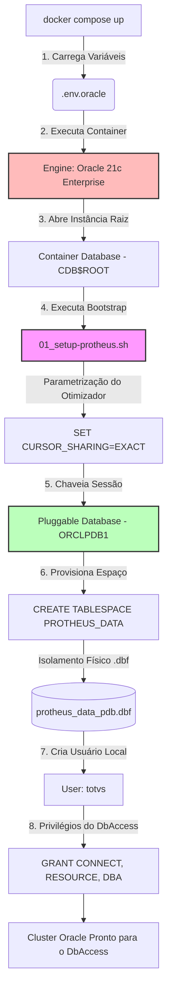

# 🐳 TOTVS Protheus - Cluster Oracle Database 21c Enterprise

Este repositório é um componente isolado da arquitetura TOTVS Protheus Modern DevOps [https://github.com/rodrigomicrosiga-devops/totvs-protheus-modern-devops], e isola e automatiza a camada de banco de dados corporativa **Oracle 21c Enterprise** customizada especificamente sob a arquitetura *Multitenant* para suportar o ecossistema do ERP TOTVS Protheus dentro da organização **`rodrigomicrosiga-devops`**.

---

## 🏗️ Arquitetura de Inicialização Multitenant (CDB/PDB)

A imagem utiliza o ciclo de vida nativo da Oracle via diretório `/opt/oracle/scripts/startup/`. O script injetado altera os parâmetros globais da instância raiz (CDB) e chaveia a sessão dinamicamente para a base acoplável (PDB), criando a estrutura física isolada exigida pelo DbAccess.

### ⚙️ Diretivas Técnicas e Governança Oracle

Para mitigar incompatibilidades do interpretador de comandos AdvPL com o otimizador relacional do Oracle, o ecossistema força as seguintes diretivas:

* **Compartilhamento de Cursor** (`CURSOR_SHARING=EXACT`): Travado de forma inegociável para garantir que o Oracle avalie o plano de execução exato das queries geradas pelo Protheus, impedindo quebras de performance por parametrização forçada em queries dinâmicas.

* **Isolamento de Tablespace**: Criação do arquivo de dados dedicado protheus_data_pdb.dbf com crescimento automático (`AUTOEXTEND ON`) dimensionado para alta performance em discos locais.

* **Segurança de Execução**: O `Dockerfile` realiza o chaveamento temporário para usuário `root` apenas para garantir os privilégios estritos de permissão (`chmod +x`) e propriedade (`chown oracle:oinstall`) exigidos pela engine de bootstrap da Oracle antes de devolver a execução ao usuário seguro em runtime.

